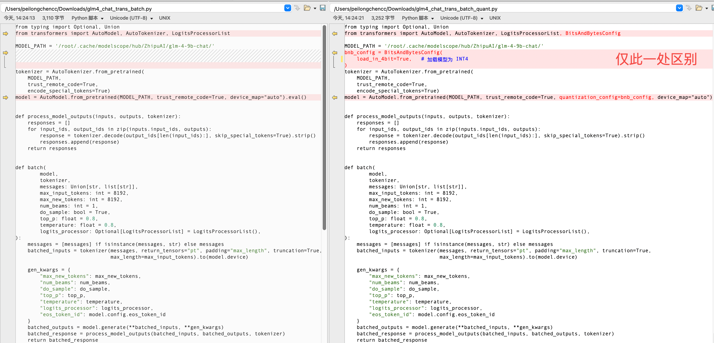

# 模型量化

量化大型语言模型（LLM）是一种优化技术，通过将模型的权重从高精度（如32位浮点数）降低为较低精度（如8位整数或16位浮点数），以减小模型的大小、减少计算资源需求，并加快推理速度。这对于在资源受限的设备上运行大型模型非常重要。

- [模型量化](#模型量化)
  - [1. Hugging Face Transformers + bitsandbytes](#1-hugging-face-transformers--bitsandbytes)
    - [用法示例:](#用法示例)
    - [bitsandbytes 的优点:](#bitsandbytes-的优点)
  - [2. TensorRT](#2-tensorrt)
    - [特点:](#特点)
    - [用法:](#用法)
  - [3. onnxruntime](#3-onnxruntime)
    - [特点:](#特点-1)
    - [用法:](#用法-1)
  - [4. PyTorch Quantization](#4-pytorch-quantization)
    - [用法示例:](#用法示例-1)
  - [5. `llm.int8()` in Hugging Face Transformers](#5-llmint8-in-hugging-face-transformers)
    - [用法:](#用法-2)
  - [6. Intel Neural Compressor (INC)](#6-intel-neural-compressor-inc)
    - [用法:](#用法-3)
  - [总结：](#总结)
  - [glm4量化示例:](#glm4量化示例)
    - [文件对比:](#文件对比)
    - [BitsAndBytesConfig 参数释义:](#bitsandbytesconfig-参数释义)

在量化 LLM 时，通常使用以下几种库和工具包：

## 1. Hugging Face Transformers + bitsandbytes

- **Hugging Face Transformers** 是目前最流行的用于处理 LLM 的框架，结合 `bitsandbytes`，你可以实现高效的模型量化。

- **`bitsandbytes`** 是一个用于低精度（如 8-bit）训练和推理的库，特别是在显存受限的 GPU 上运行时效果显著。

### 用法示例:

Hugging Face 支持使用 `bitsandbytes` 进行 8-bit 量化的模型加载，具体如下：

```python
from transformers import AutoModelForCausalLM, AutoTokenizer
import torch
from transformers import BitsAndBytesConfig

model_id = "bigscience/bloom"

# 定义 8-bit 配置
quantization_config = BitsAndBytesConfig(
    load_in_8bit=True,
    llm_int8_threshold=6.0,  # 用于量化的阈值
)

model = AutoModelForCausalLM.from_pretrained(
    model_id,
    quantization_config=quantization_config,
    device_map="auto",  # 自动映射到设备
)

tokenizer = AutoTokenizer.from_pretrained(model_id)

inputs = tokenizer("Hello, how are you?", return_tensors="pt").to("cuda")
outputs = model.generate(inputs["input_ids"], max_new_tokens=50)
print(tokenizer.decode(outputs[0], skip_special_tokens=True))
```

### bitsandbytes 的优点:

- 支持 INT8 量化，并且能够自动检测并处理量化的最优策略。

- 在推理阶段提升速度，并减少显存占用。


## 2. TensorRT

- **TensorRT** 是 NVIDIA 提供的用于高性能推理的库，支持将 FP32 模型量化为 FP16 或 INT8。

- TensorRT 具有很强的模型优化功能，特别适合在 NVIDIA GPU 上进行高效推理。

### 特点:

- 支持对 Transformer 模型进行图优化。

- 支持 FP16 和 INT8 精度。

- 针对不同硬件架构的优化非常有效，尤其是 NVIDIA GPU。

### 用法:

可以使用 Hugging Face 的 `optimum` 库将 Hugging Face 模型转换并优化为 TensorRT 推理：

```python
from transformers import AutoTokenizer, AutoModelForSeq2SeqLM
from optimum.onnxruntime import ORTModelForSeq2SeqLM
from optimum.intel import inc_quantization

model_id = "t5-small"

# 加载模型
model = ORTModelForSeq2SeqLM.from_pretrained(model_id)
tokenizer = AutoTokenizer.from_pretrained(model_id)

# 进行量化
quantizer = inc_quantization.Quantizer.from_pretrained(model_id)
quantizer.quantize(model)
```


## 3. onnxruntime

- **ONNX Runtime** 是一个通用的推理引擎，支持将模型导出为 ONNX 格式并在不同硬件（CPU、GPU、FPGA 等）上运行，提供量化支持。

- ONNX Runtime 提供了静态量化和动态量化的功能，适用于不同的推理需求。

### 特点:

- 支持多种量化方案，包括动态量化（Dynamic Quantization）、静态量化（Static Quantization）、以及量化感知训练（Quantization Aware Training）。

- 易于与现有的 PyTorch、TensorFlow 模型集成。

### 用法:

```python
import onnx
import onnxruntime as ort
from onnxruntime.quantization import quantize_dynamic, QuantType

model_path = "your_model.onnx"
quantized_model_path = "your_model_quantized.onnx"

# 执行动态量化，将模型的权重从 FP32 量化为 INT8
quantize_dynamic(
    model_path,
    quantized_model_path,
    weight_type=QuantType.QInt8
)
```


## 4. PyTorch Quantization

- PyTorch 自带的量化工具支持对 LLM 模型进行量化，包括动态量化、静态量化以及 QAT（量化感知训练）。
   
### 用法示例:

```python
import torch
from transformers import GPT2LMHeadModel

model = GPT2LMHeadModel.from_pretrained("gpt2")

# 动态量化：适用于推理时量化
quantized_model = torch.quantization.quantize_dynamic(
    model,  # 传入模型
    {torch.nn.Linear},  # 只对线性层进行量化
    dtype=torch.qint8  # 量化为 INT8
)

# 推理
inputs = tokenizer("Hello, how are you?", return_tensors="pt")
outputs = quantized_model(**inputs)
```


## 5. `llm.int8()` in Hugging Face Transformers

Hugging Face 还提供了一个用于加载量化模型的内置方法，尤其是加载 GPT 系列模型时，可以选择 `llm.int8()`，只量化具有重大影响的部分，以降低模型复杂度而不会损失太多性能。

### 用法:

```python
from transformers import GPTNeoForCausalLM

model = GPTNeoForCausalLM.from_pretrained(
    "EleutherAI/gpt-neo-1.3B",
    load_in_8bit=True  # 8-bit 量化
)
```


## 6. Intel Neural Compressor (INC)

- **Intel Neural Compressor (INC)** 是一个量化框架，支持对 PyTorch 和 TensorFlow 模型进行量化。

- INC 支持静态和动态量化，并专门为英特尔硬件进行了优化。

### 用法:

```python
from neural_compressor import quantization
from transformers import AutoModelForSequenceClassification

model = AutoModelForSequenceClassification.from_pretrained("bert-base-uncased")

# 使用 INC 进行量化
quantized_model = quantization.fit(model)
```


## 总结：

要量化 LLM 模型，常见的工具包包括：

- **Hugging Face Transformers + `bitsandbytes`**：高效的 8-bit 推理支持。
- **TensorRT**：针对 NVIDIA GPU 的高效量化推理工具。
- **ONNX Runtime**：通用的推理引擎，支持多种硬件和量化模式。
- **PyTorch Quantization**：内置的 PyTorch 量化功能。
- **Intel Neural Compressor**：适用于英特尔硬件的量化工具。

这些工具包为不同的硬件和需求提供了灵活的量化选项。


## glm4量化示例:

| 文件名                             | 文件简介                           | 备注                     |
|-----------------------------------|-----------------------------------|-------------------------|
| download_glm4.py                  | glm4-chat模型下载示例               |                         |
| glm4_chat_trans_batch.py          | glm4官方提供的batch示例版本(未量化)   | 基于transformers         |
| glm4_chat_trans_batch_quant.py    | 量化版本                           | 基于transformers         |

### 文件对比:



### BitsAndBytesConfig 参数释义:

这是一个包装类，涵盖了所有可以用于已使用 `bitsandbytes` 加载的模型的属性和特性。

该类替代了 `load_in_8bit` 或 `load_in_4bit`，因此这两种选项是互斥的。

目前仅支持 `LLM.int8()`、`FP4` 和 `NF4` 量化方式。如果 `bitsandbytes` 未来增加了更多方法，则该类将增加相应的参数。

参数说明:

- `load_in_8bit` (`bool`, *可选*, 默认值为 `False`):
  该标志用于启用 LLM.int8() 的 8 位量化功能。

- `load_in_4bit` (`bool`, *可选*, 默认值为 `False`):
  该标志用于通过替换 `bitsandbytes` 中的 Linear 层为 FP4/NF4 层来启用 4 位量化。

- `llm_int8_threshold` (`float`, *可选*, 默认值为 6.0):
  对应 `LLM.int8() : 8-bit Matrix Multiplication for Transformers at Scale` 论文（https://arxiv.org/abs/2208.07339）中提到的异常值检测的异常值阈值。任何超过该阈值的隐藏状态值将被视为异常值，并将在 fp16 精度下进行操作。通常情况下，值是正态分布的，即大多数值在 [-3.5, 3.5] 范围内，但对于大模型，有些系统性异常值的分布非常不同。此类异常值通常位于 [-60, -6] 或 [6, 60] 区间。对于大约绝对值为 5 的值，8 位量化效果较好，但超过该值后，性能损失显著。默认的阈值为 6，但对于不太稳定的模型（如小模型、微调模型），可能需要更低的阈值。

- `llm_int8_skip_modules` (`List[str]`, *可选*):
  显式列出不希望进行 8 位转换的模块列表。此功能对像 Jukebox 这样的模型非常有用，它在不同位置具有多个 head，并不一定位于最后一个位置。例如，对于 `CausalLM` 模型，最后的 `lm_head` 将保留其原始 `dtype`。

- `llm_int8_enable_fp32_cpu_offload` (`bool`, *可选*, 默认值为 `False`):
  此标志用于高级用例和对该功能有了解的用户。如果您希望将模型分成不同部分，并在 GPU 上以 int8 运行部分模型、在 CPU 上以 fp32 运行其他部分模型，则可以使用此标志。对于像 `google/flan-t5-xxl` 这样的大模型的卸载很有用。请注意，int8 操作不会在 CPU 上运行。

- `llm_int8_has_fp16_weight` (`bool`, *可选*, 默认值为 `False`):
  该标志允许使用 16 位的主权重来运行 LLM.int8()。对于微调很有用，因为权重在反向传播时不需要来回转换。

- `bnb_4bit_compute_dtype` (`torch.dtype` 或 str, *可选*, 默认值为 `torch.float32`):
  设置计算数据类型，该类型可以不同于输入数据类型。例如，输入可能是 fp32，但计算可以设置为 bf16 以提升计算速度。

- `bnb_4bit_quant_type` (`str`, *可选*, 默认值为 `"fp4"`):
  设置 `bnb.nn.Linear4Bit` 层的量化数据类型。可选项为 FP4 和 NF4，分别用 `fp4` 或 `nf4` 指定。

- `bnb_4bit_use_double_quant` (`bool`, *可选*, 默认值为 `False`):
  启用嵌套量化，该量化方法会将第一次量化的量化常数再次量化。

- `bnb_4bit_quant_storage` (`torch.dtype` 或 str, *可选*, 默认值为 `torch.uint8`):
  设置存储类型，用于打包 4 位量化参数。

- `kwargs` (`Dict[str, Any]`, *可选*):
  用于初始化配置对象的其他参数。